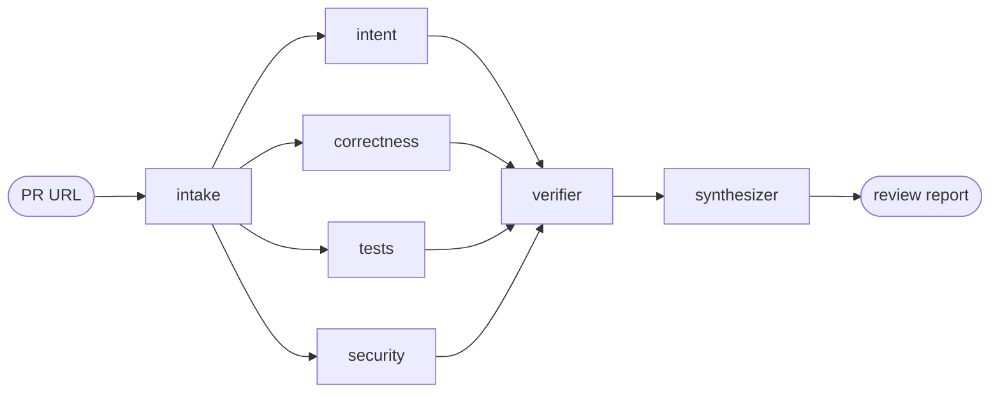

# pr-crew

pr-crew reviews a public GitHub pull request with a small crew of LLM agents instead of one: four specialists read the diff in parallel, an adversarial verifier rejects anything they can't back up with a real quote from the diff, and a synthesizer turns the survivors into one report. A React frontend streams the whole run live, agent by agent, over SSE.

<!-- screenshot: added after deploy -->

## Architecture



`intake` fetches the PR diff, title, description, and any linked issue from GitHub. Four specialists run concurrently as LangGraph nodes fanning out from `intake`:

- **intent** — does the diff actually do what the PR description and linked issue claim?
- **correctness** — logic errors, broken invariants, unhandled edge cases
- **tests** — behavior changed without coverage, weakened or deleted tests
- **security** — injection, missing authz, secrets, unsafe deserialization

Each specialist is instructed to report only findings it can support with a direct quote from the diff, and to return nothing rather than invent an issue (`apps/api/src/prcrew/graph/specialists.py`). The graph joins on all four before running the verifier and synthesizer (`apps/api/src/prcrew/graph/build.py`).

## Why the verifier exists

Four independent LLM calls produce four independent hallucination surfaces. The **verifier** node (`apps/api/src/prcrew/graph/verifier.py`) is a fifth, adversarial LLM call that re-reads the diff against every numbered finding and rejects it if the quoted evidence doesn't actually appear in the diff, misreads the code, or describes something the diff didn't touch. It defaults to rejecting when uncertain, and if the verifier call itself fails, findings pass through unverified rather than silently vanishing. Only confirmed findings reach the synthesizer — this is the difference between "an agent said so" and "an agent said so and a second agent checked."

## Local development

**Backend** (from `apps/api`):

```bash
uv sync --all-extras --dev
ANTHROPIC_API_KEY=... GITHUB_TOKEN=... uv run uvicorn 'prcrew.api.app:create_app' --factory --port 8000
```

Required env vars:
- `ANTHROPIC_API_KEY` — Claude API key
- `GITHUB_TOKEN` — GitHub token for fetching PR diffs/issues

Optional env vars (see `apps/api/src/prcrew/settings.py`):
- `SPECIALIST_MODEL` (default `claude-haiku-4-5-20251001`)
- `SYNTH_MODEL` (default `claude-sonnet-5`)
- `DAILY_RATE_LIMIT` (default `5/day`)
- `CORS_ORIGINS` (default `*`)

**Frontend** (from `apps/web`):

```bash
npm install
VITE_API_BASE_URL=http://localhost:8000 npm run dev
```

**Showcase generation** (owner-run, records a real review as a replayable showcase — needs real API keys):

```bash
uv run python scripts/generate_showcase.py <pr_url> <slug> "<title>"
```

## Demo cost controls

This is a public demo backed by paid LLM calls, so it's guarded on several axes:

- **Per-IP rate limit** — 5 review requests per day by default (`DAILY_RATE_LIMIT`), enforced with `slowapi` in `apps/api/src/prcrew/api/app.py`
- **Size guards** — PRs over 20 changed files or 500 changed lines are rejected before any LLM call (`MAX_FILES`, `MAX_LINES` in `apps/api/src/prcrew/github/client.py`)
- **Public repos only** — private repos are rejected at the GitHub-fetch step
- **Haiku for live runs** — specialists default to `claude-haiku-4-5-20251001`; only the synthesizer uses a larger model
- **Showcase replays cost zero** — the showcase gallery replays precomputed event streams from disk (`apps/api/src/prcrew/showcases/store.py`); no LLM calls happen on replay

## Testing

```bash
# backend, from apps/api
uv run pytest

# frontend, from apps/web
npm test
```

CI (`.github/workflows/ci.yml`) runs `ruff check` + `pytest` for the backend and `tsc --noEmit` + `vitest` for the frontend on every push and PR to `main`.
